# NutriSaver

NutriSaver is a full-stack, multi-featured mobile application which aims to reduce individual food waste, save users time and money. This app provides users with a virtual “snapshot” of their current food supply, including detailed information regarding food item quantities, where they are physically stored (fridge, freezer, pantry) and their estimated expiration dates. It also allows them to quickly find recipes built around ingredients on-hand via the Yummly API. I built this application in only 2 Weeks as part of my Prime Academy Solo Project, using ReactJS, Redux, Node, Express, PostgreSQL, and more.

Since the nature of this app is highly personal in nature, all users are first required to sign in using their unique username and password. Upon login, the user will be brought to their virtual "Kitchen", where they can view all current food items (via an expanding panel) in their Freezer, Fridge, and Pantry by clicking on each location. If a user clicks an individual food item, a popup modal will display more details about that item. From here, a user can make in-line edits to that item, or remove that item.

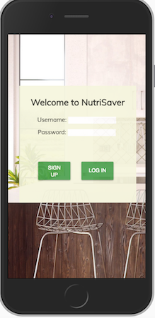
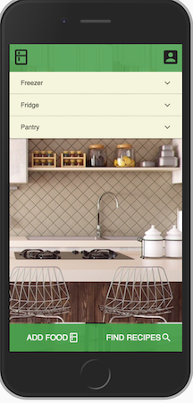
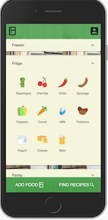
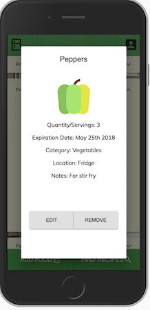

If a user clicks the "Add Food" button at the bottom-left, they are brought to the Add Food form and can add food items to their kitchen.

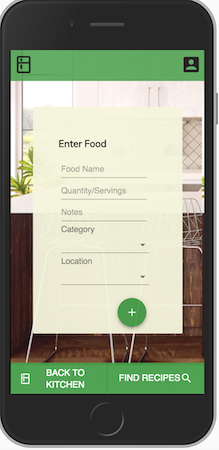

If a user has any food about to expire, a modal will popup immediately upon login to alert the user of their expiring items.

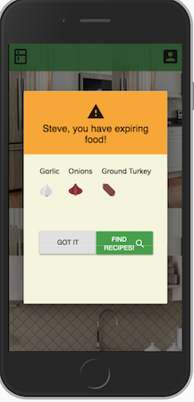

If a user clicks the "Find Recipes" button at the bottom-right, they are brought to the second feature of the app, the Recipe Builder. First, the user can select any of their current food items to include in their search. Any expiring items are highlighted as another reminder to the user.

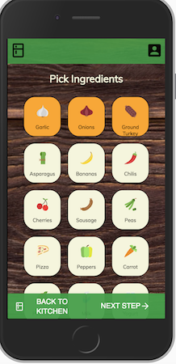

Next, a user can add additional search parameters, such as keywords and any excluded foods (allergies, aversions, etc).

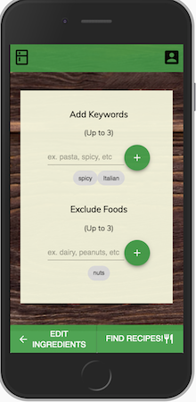

Upon pushing the "Find Recipes" button from this page, the app will generate a list of recipes from the Yummly API based on their unique search terms and food items.

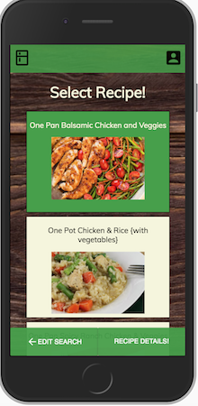

A user can then select a recipe from the list and get more details about the recipe by clicking the "Recipe Details" button in the bottom-right.

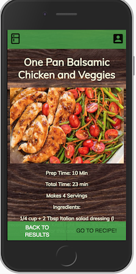

Finally, if a user wants to make this recipe, they can click the "Go To Recipe" button in the bottom-right. This will take them to the recipe source URL, where they can view all necessary ingredients and the recipe instructions. This is the ideal end-point for this app.

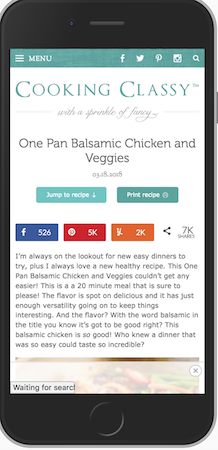


## This application is built with: 
- ReactJS/React Redux
- Node.js
- Express
- Material UI
- PostgreSQL
- Moment.js
- Yummly API

### Database Setup - PostgreSQL

``` 
CREATE TABLE person (
    id SERIAL PRIMARY KEY,
    username VARCHAR (80) UNIQUE NOT NULL,
    password VARCHAR (1000) NOT NULL
);

CREATE TABLE foodItems (
	id SERIAL PRIMARY KEY,
	user_id INT REFERENCES person(id),
	name VARCHAR (80) NOT NULL default 'Food',
	quantity INT NOT NULL default 1,
	category VARCHAR (80) NOT NULL default 'Misc',
	location VARCHAR (40) NOT NULL default 'Fridge',
	add_date DATE NOT NULL default CURRENT_DATE,
	exp_date DATE NOT NULL default CURRENT_DATE,
	notes VARCHAR(500),
	image_url VARCHAR (200)
);

INSERT INTO foodItems (name, quantity, category, location, notes) VALUES ('Ice Cream','1','Dairy','Freezer', 'Delicious!'), 
('Jalapeno','5', 'Vegetables', 'Fridge', 'Use in chili?');

### Handcrafted by Steve Hogan, 2018
